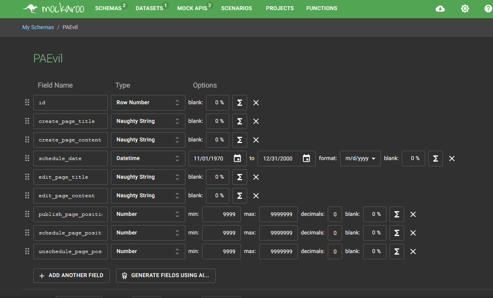

# Playwright guide

## Requirements

- node 18.18.x
- There should be **NO** nor **Scheduled** draft pages, if there are pages in the draft state, please publish them manually in the URL.

URL: [http://3.138.112.48/ghost](http://3.138.112.48/ghost)

### Strategy

We used Mockaroo and Faker. We created a schema/configuration for each scenario (evil and regular) and used it in its context.

Playwright lets us configure various projects which populate any series of tests. This population is what we used in order to have apriori, dynamic and random tests. It also what we used to make the evil and regular cases that represent distinc functionalities. This can be seen in [playwright.config.ts](./playwright.config.ts), but you'll find here and example.

```javascript
    {
      name: 'dynamic',
      use: {
        ...devices['Desktop Chrome'],
        storageState: 'playwright/.auth/user.json',
        ...readDynamicContent(),
      },
      testMatch: '**/*.spec.ts',
      dependencies: ['setup'],
    }
```

You can see that we have configured a dynamic project, that `uses` the readDynamicContent function, which is in charge of reading the dynamic file that is saved everytime a tests is ran. Another example:

```javascript
    {
      "name": "random-evil",
      "use": {
        ...devices['Desktop Chrome'],
        storageState: 'playwright/.auth/user.json',
        ...generateRandomEvil(),
      },
      testMatch: '**/*.spec.ts',
      dependencies: ['setup'],
    }
```


#### Apriori

For apriori scenarios, we used mockaroo to create a schema and downloaded it from the site. This schema is saved in the repo and should not be updated.
We created a schema for regular and "evil" scenarios, which should represent test cases that use strange numbers or fail. You can find the code
[here](./tests-a-priori/apriori.ts).

Evil scenario:



Regular scenario:


#### Dynamic

For dynamic scenarios, like apriori ones, we used mockaroo to create a schema, evil or regular, and used the api to load it when running the scenarios. You can see the code [here](auth\auth.setup.ts#L7). It is dynamic because it populates a table that is read in the initialization of the playwright app every time we run a test. We, however, encourage you to reset the playwright suite in order to make each test more dynamic. You can find the code
[here](./test-dynamic-pool/dynamic-pool.ts).

#### Random

For random scenarios, we configured two functions that use `fakerJs`. In them there is an implementation that shows the intent of showing random values that should or should not destroy the tests. You can find the [here](./test-random-scenario/random.ts)

### Steps to run the tests

1. Make sure you have installed a fresh version of ghost. If you want to follow this tutorial correctly, please follow the README.md in the root of this repository. If you have installed a version of ghost make SURE you uninstall it and reinstall it, as this tutorial has signup and login. [README.md](../../README.md)
2. Make sure you are in the folder pruebas-e2e/playwright, the same one where this README.md lives.
3. `npm install`
4. `npx playwright install` to install playwrights browsers
4. `npm run test:pages`
5. Enable the tests you want to run. The tests are split like this: 
   1. Create Page works: 
      1. apriori
      2. dynamic
      3. random
   2. Create Page Fails:
      1. apriori
      2. dynamic
      3. random
   3. Edit Page Works: 
      1. apriori
      2. dynamic
      3. random
   2. Edit Page Fails:
      1. apriori
      2. dynamic
      3. random
   3. Publish Page Works: 
      1. apriori
      2. dynamic
      3. random
   2. Publish Page Fails:
      1. apriori
      2. dynamic
      3. random
   3. Schedule Page Works: 
      1. apriori
      2. dynamic
      3. random
   2. Schedule Page Fails:
      1. apriori
      2. dynamic
      3. random
   3. Unschedule Page Works: 
      1. apriori
      2. dynamic
      3. random
   2. Unschedule Page Fails:
      1. apriori
      2. dynamic
      3. random
6. You can test each batch by configuring playwrights projects so it is able to run the tests you are interested. Each configuration can be seen like this:

    

    In it, you *MUST* select the setup and *ONE* test like in the image seen above.

8. **IMPORTANT** Tests will most likely fail the first time you run them, so please try running them again a second time. Before running them again, please try running the authentication before. This is because it is setting up the authentication and playwright preloads the pages when it is setting up the tests.  


## If you cannot see any playwright tests in the ui
1. Click on the top left where you see `Projects:`, make sure it has selected setup and chromium. Keep in mind that for tests to actually work you need to enable `setup` + `apriori/dynamic/random` + `evil/~`
#### Step 1

#### Step 2
